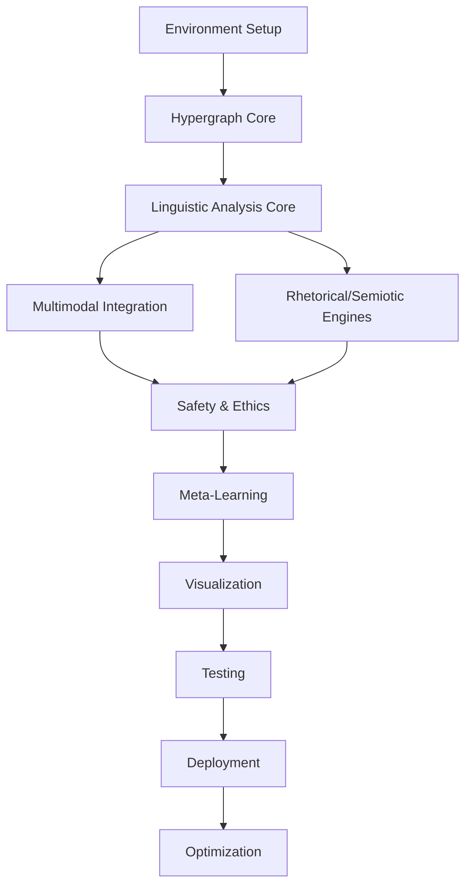

# Rhetorical-Linguistic Operating System (RLOS)

## Exhaustive Implementation Roadmap

### Executive Overview

This roadmap provides atomic-level task decomposition for implementing the Rhetorical-Linguistic Operating System. Each task is designed to be independently executable with clear dependencies, deliverables, and validation criteria.

-----

## PHASE 0: FOUNDATION & INFRASTRUCTURE

**Duration: Months 1-2**
**Goal: Establish development environment and core infrastructure**

### 0.1 Development Environment Setup

#### 0.1.1 Repository Structure

```
Task ID: ENV-001
Dependencies: None
Duration: 2 days
Deliverables:
- Create GitHub/GitLab repository
- Initialize directory structure:
  /core
    /hypergraph
    /schemas
    /utils
  /modules
    /phonology
    /morphology
    /syntax
    /semantics
    /pragmatics
    /discourse
    /sociolinguistics
    /iconography
  /engines
    /rhetorical
    /semiotic
    /multimodal
  /interfaces
    /api
    /visualization
    /ide
  /safety
    /gates
    /audit
  /meta
    /learning
    /evolution
  /data
    /corpora
    /models
    /cache
  /tests
  /docs
  /deployment
```

#### 0.1.2 Development Tools Configuration

```
Task ID: ENV-002
Dependencies: ENV-001
Duration: 1 day
Atomic Tasks:
- Install Python 3.11+ environment
- Configure Poetry/pip for dependency management
- Setup pre-commit hooks (black, flake8, mypy)
- Configure Git LFS for large files
- Install Docker and Docker Compose
- Setup CUDA toolkit (if GPU available)
- Configure VS Code/PyCharm with project settings
```

#### 0.1.3 CI/CD Pipeline

```
Task ID: ENV-003
Dependencies: ENV-002
Duration: 3 days
Atomic Tasks:
- Create GitHub Actions workflows:
  - .github/workflows/test.yml (unit tests)
  - .github/workflows/integration.yml
  - .github/workflows/build.yml
  - .github/workflows/deploy.yml
- Configure test coverage requirements (>80%)
- Setup semantic versioning
- Configure automated documentation builds
- Implement dependency vulnerability scanning
```

### 0.2 Core Dependencies Installation

#### 0.2.1 Machine Learning Framework

```
Task ID: DEP-001
Dependencies: ENV-002
Duration: 1 day
Atomic Tasks:
- Install PyTorch 2.0+ with CUDA support
- Install Hugging Face Transformers
- Install JAX/Flax for meta-learning
- Configure model checkpoint management
- Setup Weights & Biases for experiment tracking
```

#### 0.2.2 Graph Processing Libraries

```
Task ID: DEP-002
Dependencies: ENV-002
Duration: 1 day
Atomic Tasks:
- Install NetworkX for graph algorithms
- Install DGL or PyTorch Geometric
- Setup Neo4j database and py2neo client
- Install graph-tool for performance-critical operations
- Configure Redis for graph caching
```

#### 0.2.3 NLP & Linguistic Tools

```
Task ID: DEP-003
Dependencies: ENV-002
Duration: 2 days
Atomic Tasks:
- Install spaCy with language models
- Install NLTK with data downloads
- Setup Stanford CoreNLP server
- Install phonemizer for G2P
- Install pymorphy2 for morphological analysis
- Configure language detection (langdetect, polyglot)
- Install ICU for Unicode handling
```

-----

## PHASE 1: HYPERGRAPH CORE

**Duration: Months 2-3**
**Goal: Implement unified representation system**

### 1.1 Hypergraph Data Structure

#### 1.1.1 Base Classes

```
Task ID: HG-001
Dependencies: DEP-002
Duration: 3 days
File: /core/hypergraph/base.py
Atomic Tasks:
- Define HyperNode class:
  - id: UUID
  - type: Enum(concept, entity, token, icon)
  - properties: Dict[str, Any]
  - embeddings: Dict[str, np.ndarray]
- Define HyperEdge class:
  - id: UUID
  - nodes: Set[UUID]
  - label: str
  - properties: Dict[str, Any]
  - weight: float
- Implement serialization methods
- Add validation decorators
```

#### 1.1.2 Graph Operations

```
Task ID: HG-002
Dependencies: HG-001
Duration: 5 days
File: /core/hypergraph/operations.py
Atomic Tasks:
- Implement add_node(node: HyperNode)
- Implement add_edge(edge: HyperEdge)
- Implement remove_node(id: UUID)
- Implement remove_edge(id: UUID)
- Implement get_neighbors(node_id: UUID)
- Implement subgraph extraction
- Implement graph merging
- Add transaction support
- Implement graph diffing
```

#### 1.1.3 Query Interface

```
Task ID: HG-003
Dependencies: HG-002
Duration: 4 days
File: /core/hypergraph/query.py
Atomic Tasks:
- Implement Cypher-like query language parser
- Create query optimizer
- Implement pattern matching
- Add full-text search capability
- Create index structures
- Implement batch query processing
- Add query caching layer
```

### 1.2 Schema Definitions

#### 1.2.1 Linguistic Schemas

```
Task ID: SCH-001
Dependencies: HG-001
Duration: 3 days
File: /core/schemas/linguistic.py
Atomic Tasks:
- Define PhonemeNode schema
- Define MorphemeNode schema
- Define LexemeNode schema
- Define SyntacticNode schema
- Define SemanticNode schema
- Define DiscourseNode schema
- Create validation rules
- Implement schema versioning
```

#### 1.2.2 Multimodal Schemas

```
Task ID: SCH-002
Dependencies: HG-001
Duration: 2 days
File: /core/schemas/multimodal.py
Atomic Tasks:
- Define AudioNode schema
- Define ImageNode schema
- Define VideoNode schema
- Define GestureNode schema
- Define IconNode (emoji/hieroglyph)
- Create cross-modal link schemas
```

-----

## PHASE 2: LINGUISTIC ANALYSIS CORE (LAC)

**Duration: Months 3-5**
**Goal: Implement all linguistic processing modules**

### 2.1 Phonological Module

#### 2.1.1 Audio Processing Pipeline

```
Task ID: PHON-001
Dependencies: DEP-003
Duration: 5 days
File: /modules/phonology/audio_processor.py
Atomic Tasks:
- Implement audio file loading (wav, mp3, flac)
- Create resampling pipeline (16kHz standard)
- Implement VAD (Voice Activity Detection)
- Add noise reduction filters
- Create audio segmentation
- Implement feature extraction:
  - MFCCs
  - Pitch (F0) tracking
  - Energy/amplitude
  - Spectral features
```

#### 2.1.2 Prosodic Analysis

```
Task ID: PHON-002
Dependencies: PHON-001
Duration: 4 days
File: /modules/phonology/prosody.py
Atomic Tasks:
- Implement pitch contour extraction
- Create stress detection algorithm
- Implement rhythm analysis
- Add intonation pattern recognition
- Create prosodic phrase boundary detection
- Implement emotion detection from prosody
```

#### 2.1.3 Phoneme Recognition

```
Task ID: PHON-003
Dependencies: PHON-001
Duration: 3 days
File: /modules/phonology/phonemes.py
Atomic Tasks:
- Integrate acoustic model (wav2vec2)
- Implement forced alignment
- Create phoneme-to-grapheme mapping
- Add IPA transcription support
- Implement cross-lingual phoneme mapping
```

### 2.2 Morphological Module

#### 2.2.1 Tokenization

```
Task ID: MORPH-001
Dependencies: DEP-003
Duration: 3 days
File: /modules/morphology/tokenizer.py
Atomic Tasks:
- Implement Unicode-aware tokenization
- Add language-specific tokenizers:
  - English (Penn Treebank)
  - Chinese (jieba)
  - Japanese (MeCab)
  - Arabic (CAMeL)
- Handle emoji/emoticon tokenization
- Implement subword tokenization (BPE, WordPiece)
- Add custom vocabulary support
```

#### 2.2.2 Morphological Analysis

```
Task ID: MORPH-002
Dependencies: MORPH-001
Duration: 5 days
File: /modules/morphology/analyzer.py
Atomic Tasks:
- Implement stemming algorithms
- Add lemmatization
- Create morpheme segmentation
- Implement inflection generation
- Add derivation analysis
- Create compound word analyzer
- Support agglutinative languages
```

#### 2.2.3 Lexicon Management

```
Task ID: MORPH-003
Dependencies: MORPH-002
Duration: 4 days
File: /modules/morphology/lexicon.py
Atomic Tasks:
- Create lexicon database schema
- Implement word frequency tracking
- Add neologism detection
- Create multimodal lexicon (words + emoji)
- Implement lexicon update mechanisms
- Add dialectal variant tracking
```

### 2.3 Syntactic Module

#### 2.3.1 Constituency Parsing

```
Task ID: SYN-001
Dependencies: MORPH-001
Duration: 4 days
File: /modules/syntax/constituency.py
Atomic Tasks:
- Integrate Berkeley Neural Parser
- Implement CKY algorithm
- Add grammar rule extraction
- Create parse tree visualization
- Implement partial parsing for fragments
- Add confidence scoring
```

#### 2.3.2 Dependency Parsing

```
Task ID: SYN-002
Dependencies: MORPH-001
Duration: 4 days
File: /modules/syntax/dependency.py
Atomic Tasks:
- Integrate spaCy dependency parser
- Implement graph-based parsing
- Add Universal Dependencies support
- Create dependency relation extraction
- Implement cross-lingual parsing
- Add enhanced dependencies
```

#### 2.3.3 Rhetorical Structure Parsing

```
Task ID: SYN-003
Dependencies: SYN-001, SYN-002
Duration: 5 days
File: /modules/syntax/rhetorical.py
Atomic Tasks:
- Implement RST parser
- Create nucleus-satellite detection
- Add discourse relation classification
- Implement hierarchical structure building
- Create rhetorical tree visualization
```

### 2.4 Semantic Module

#### 2.4.1 Named Entity Recognition

```
Task ID: SEM-001
Dependencies: MORPH-001
Duration: 3 days
File: /modules/semantics/ner.py
Atomic Tasks:
- Integrate transformer-based NER
- Implement entity typing (person, org, loc, etc.)
- Add entity linking to knowledge base
- Create coreference resolution
- Implement nested entity recognition
```

#### 2.4.2 Semantic Role Labeling

```
Task ID: SEM-002
Dependencies: SYN-002
Duration: 4 days
File: /modules/semantics/srl.py
Atomic Tasks:
- Implement PropBank-style SRL
- Add FrameNet parsing
- Create argument identification
- Implement role classification
- Add implicit argument detection
```

#### 2.4.3 Word Sense Disambiguation

```
Task ID: SEM-003
Dependencies: MORPH-002
Duration: 3 days
File: /modules/semantics/wsd.py
Atomic Tasks:
- Integrate WordNet
- Implement Lesk algorithm
- Add neural WSD model
- Create sense inventory management
- Implement cross-lingual sense mapping
```

### 2.5 Pragmatic Module

#### 2.5.1 Speech Act Classification

```
Task ID: PRAG-001
Dependencies: SEM-001
Duration: 3 days
File: /modules/pragmatics/speech_acts.py
Atomic Tasks:
- Implement speech act taxonomy
- Create classifier for act types
- Add illocutionary force detection
- Implement indirect speech act recognition
- Create politeness analysis
```

#### 2.5.2 Discourse State Tracking

```
Task ID: PRAG-002
Dependencies: PRAG-001
Duration: 4 days
File: /modules/pragmatics/discourse_state.py
Atomic Tasks:
- Implement dialogue state representation
- Create belief state tracking
- Add user intent recognition
- Implement dialogue act classification
- Create context management system
```

#### 2.5.3 Implicature Resolution

```
Task ID: PRAG-003
Dependencies: PRAG-001
Duration: 3 days
File: /modules/pragmatics/implicature.py
Atomic Tasks:
- Implement Gricean maxim detection
- Create scalar implicature resolution
- Add conventional implicature handling
- Implement pragmatic inference engine
```

### 2.6 Discourse Module

#### 2.6.1 Coherence Analysis

```
Task ID: DISC-001
Dependencies: SYN-003
Duration: 4 days
File: /modules/discourse/coherence.py
Atomic Tasks:
- Implement entity-based coherence
- Create Centering Theory analyzer
- Add lexical cohesion detection
- Implement coherence scoring
- Create coherence visualization
```

#### 2.6.2 Topic Modeling

```
Task ID: DISC-002
Dependencies: SEM-001
Duration: 3 days
File: /modules/discourse/topics.py
Atomic Tasks:
- Implement LDA
- Add neural topic models
- Create dynamic topic tracking
- Implement topic segmentation
- Add topic hierarchy extraction
```

### 2.7 Sociolinguistic Module

#### 2.7.1 Register Detection

```
Task ID: SOCIO-001
Dependencies: MORPH-003
Duration: 3 days
File: /modules/sociolinguistics/register.py
Atomic Tasks:
- Implement formality detection
- Create genre classification
- Add style analysis
- Implement register-specific feature extraction
```

#### 2.7.2 Dialect Identification

```
Task ID: SOCIO-002
Dependencies: PHON-003, MORPH-003
Duration: 4 days
File: /modules/sociolinguistics/dialect.py
Atomic Tasks:
- Implement dialect classification
- Create dialect feature extraction
- Add code-switching detection
- Implement dialect normalization
```

-----

## PHASE 3: MULTIMODAL INTEGRATION

**Duration: Months 5-6**
**Goal: Implement cross-modal processing**

### 3.1 Visual Processing

#### 3.1.1 Image Analysis

```
Task ID: VIS-001
Dependencies: DEP-001
Duration: 4 days
File: /engines/multimodal/vision.py
Atomic Tasks:
- Integrate CLIP for image encoding
- Implement OCR for text extraction
- Add object detection
- Create scene graph generation
- Implement visual sentiment analysis
```

#### 3.1.2 Emoji/Icon Processing

```
Task ID: VIS-002
Dependencies: MORPH-003
Duration: 3 days
File: /modules/iconography/emoji.py
Atomic Tasks:
- Create emoji unicode database
- Implement emoji sentiment mapping
- Add emoji-to-text conversion
- Create contextual emoji interpretation
- Implement emoji generation rules
```

### 3.2 Cross-Modal Alignment

#### 3.2.1 Text-Image Alignment

```
Task ID: ALIGN-001
Dependencies: VIS-001, SEM-001
Duration: 5 days
File: /engines/multimodal/alignment.py
Atomic Tasks:
- Implement cross-attention mechanisms
- Create multimodal embeddings
- Add grounding detection
- Implement reference resolution
- Create alignment visualization
```

-----

## PHASE 4: RHETORICAL & SEMIOTIC ENGINES

**Duration: Months 6-7**
**Goal: Implement persuasion and sign analysis**

### 4.1 Rhetorical Strategy Engine

#### 4.1.1 Argument Mining

```
Task ID: RHET-001
Dependencies: SYN-003, SEM-002
Duration: 5 days
File: /engines/rhetorical/argument.py
Atomic Tasks:
- Implement claim detection
- Create evidence extraction
- Add warrant identification
- Implement argument structure parsing
- Create fallacy detection
```

#### 4.1.2 Persuasion Analysis

```
Task ID: RHET-002
Dependencies: RHET-001
Duration: 4 days
File: /engines/rhetorical/persuasion.py
Atomic Tasks:
- Implement ethos detection
- Create pathos analysis
- Add logos evaluation
- Implement kairos assessment
- Create persuasion scoring
```

### 4.2 Semiotic Engine

#### 4.2.1 Sign Analysis

```
Task ID: SEMI-001
Dependencies: VIS-002
Duration: 4 days
File: /engines/semiotic/signs.py
Atomic Tasks:
- Implement Peircean sign classification
- Create sign-object-interpretant mapping
- Add connotation/denotation analysis
- Implement semiotic chain tracking
```

-----

## PHASE 5: SAFETY & ETHICS

**Duration: Month 8**
**Goal: Implement dual-mode safety system**

### 5.1 Safety Gates

#### 5.1.1 Content Filtering

```
Task ID: SAFE-001
Dependencies: SEM-001
Duration: 4 days
File: /safety/gates/content_filter.py
Atomic Tasks:
- Implement toxicity detection
- Create hate speech classifier
- Add NSFW content detection
- Implement misinformation detection
- Create safety scoring system
```

#### 5.1.2 Mode Management

```
Task ID: SAFE-002
Dependencies: SAFE-001
Duration: 3 days
File: /safety/gates/mode_manager.py
Atomic Tasks:
- Implement RAW/PUBLIC mode switching
- Create access control system
- Add audit logging
- Implement rate limiting
- Create usage monitoring
```

-----

## PHASE 6: META-LEARNING & EVOLUTION

**Duration: Months 8-9**
**Goal: Implement adaptive learning system**

### 6.1 Meta-Learning Controller

#### 6.1.1 Few-Shot Adaptation

```
Task ID: META-001
Dependencies: DEP-001
Duration: 5 days
File: /meta/learning/few_shot.py
Atomic Tasks:
- Implement MAML algorithm
- Create task distribution sampling
- Add gradient-based adaptation
- Implement prototypical networks
- Create adaptation evaluation
```

#### 6.1.2 Continuous Learning

```
Task ID: META-002
Dependencies: META-001
Duration: 4 days
File: /meta/evolution/continuous.py
Atomic Tasks:
- Implement experience replay
- Create drift detection
- Add incremental learning
- Implement forgetting mitigation
- Create knowledge consolidation
```

-----

## PHASE 7: VISUALIZATION & INTERFACE

**Duration: Months 9-10**
**Goal: Build user interfaces**

### 7.1 Visualization Engine

#### 7.1.1 Graph Visualization

```
Task ID: VIZ-001
Dependencies: HG-003
Duration: 5 days
File: /interfaces/visualization/graph_viz.py
Atomic Tasks:
- Implement force-directed layout
- Create hierarchical layout
- Add interactive navigation
- Implement layer filtering
- Create node/edge styling
```

#### 7.1.2 Rhetorical Visualization

```
Task ID: VIZ-002
Dependencies: RHET-001
Duration: 4 days
File: /interfaces/visualization/rhetorical_viz.py
Atomic Tasks:
- Implement argument structure viz
- Create persuasion heatmaps
- Add rhetorical flow diagrams
- Implement timeline visualization
```

### 7.2 API Development

#### 7.2.1 REST API

```
Task ID: API-001
Dependencies: All modules
Duration: 5 days
File: /interfaces/api/rest.py
Atomic Tasks:
- Implement FastAPI application
- Create endpoint routing
- Add request validation
- Implement response formatting
- Create API documentation
- Add authentication/authorization
```

-----

## PHASE 8: TESTING & VALIDATION

**Duration: Month 11**
**Goal: Comprehensive testing**

### 8.1 Unit Testing

#### 8.1.1 Module Tests

```
Task ID: TEST-001
Dependencies: All modules
Duration: 10 days
Files: /tests/unit/
Atomic Tasks:
- Write tests for each module
- Achieve 80%+ code coverage
- Create mock data fixtures
- Implement property-based testing
- Add regression test suite
```

### 8.2 Integration Testing

#### 8.2.1 End-to-End Tests

```
Task ID: TEST-002
Dependencies: TEST-001
Duration: 5 days
Files: /tests/integration/
Atomic Tasks:
- Create multilingual test cases
- Implement multimodal tests
- Add performance benchmarks
- Create stress tests
- Implement safety validation
```

-----

## PHASE 9: DEPLOYMENT

**Duration: Month 12**
**Goal: Production deployment**

### 9.1 Containerization

#### 9.1.1 Docker Setup

```
Task ID: DEPLOY-001
Dependencies: TEST-002
Duration: 3 days
Files: /deployment/
Atomic Tasks:
- Create Dockerfile for each service
- Write docker-compose.yml
- Implement health checks
- Create volume management
- Add logging configuration
```

### 9.2 Cloud Deployment

#### 9.2.1 Kubernetes Configuration

```
Task ID: DEPLOY-002
Dependencies: DEPLOY-001
Duration: 5 days
Files: /deployment/k8s/
Atomic Tasks:
- Create deployment manifests
- Configure services
- Implement auto-scaling
- Add monitoring (Prometheus)
- Create backup strategies
```

-----

## PHASE 10: OPTIMIZATION & SCALING

**Duration: Ongoing**
**Goal: Performance optimization**

### 10.1 Performance Optimization

#### 10.1.1 Model Optimization

```
Task ID: OPT-001
Dependencies: DEPLOY-002
Duration: Ongoing
Atomic Tasks:
- Implement model quantization
- Add knowledge distillation
- Create model pruning
- Implement caching strategies
- Optimize batch processing
```

-----

## Critical Path Dependencies



-----

## Resource Requirements

### Human Resources

- **Core Team**: 8-10 developers
- **Specializations**:
  - 2 ML Engineers (neural models)
  - 2 NLP Engineers (linguistic modules)
  - 1 Graph Database Engineer
  - 1 Frontend Developer (visualization)
  - 1 DevOps Engineer
  - 1 Safety/Ethics Specialist
  - 1 Project Manager
  - 1 Technical Writer

### Infrastructure

- **Development**: 4x GPU workstations (RTX 4090 or A100)
- **Training**: Cloud GPU cluster (8x A100 minimum)
- **Storage**: 50TB for corpora and models
- **Production**: Kubernetes cluster (16 nodes minimum)

### Estimated Timeline

- **Total Duration**: 12 months for MVP
- **Phase Overlap**: 20% between adjacent phases
- **Buffer**: 15% contingency time included

-----

## Validation Metrics

### Technical Metrics

- Code coverage: >80%
- API latency: <100ms (p95)
- Model accuracy: >90% on standard benchmarks
- System availability: 99.9%

### Linguistic Performance

- Parsing accuracy: >95% (English), >90% (other languages)
- Rhetorical detection F1: >0.85
- Multimodal alignment: >0.80 IoU

### Safety Metrics

- Toxicity false negative rate: <0.01%
- Bias detection coverage: >95%
- Audit compliance: 100%

-----

## Risk Mitigation

### Technical Risks

1. **Hypergraph scalability**: Implement sharding early
1. **Model latency**: Use caching and quantization
1. **Cross-modal alignment**: Extensive testing on edge cases

### Organizational Risks

1. **Scope creep**: Strict phase gates and deliverable tracking
1. **Technical debt**: Mandatory refactoring sprints
1. **Knowledge silos**: Pair programming and documentation

This roadmap provides 200+ atomic tasks, each with clear dependencies and deliverables, enabling parallel development where possible while maintaining critical path integrity.​​​​​​​​​​​​​​​​